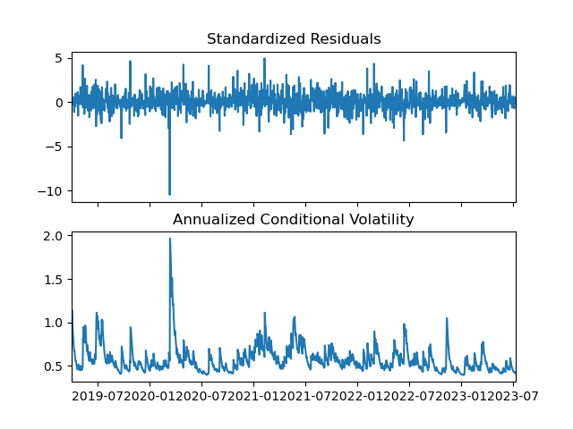
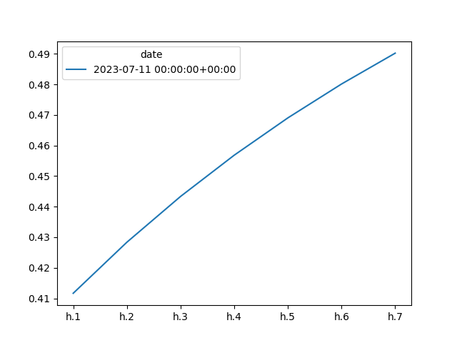
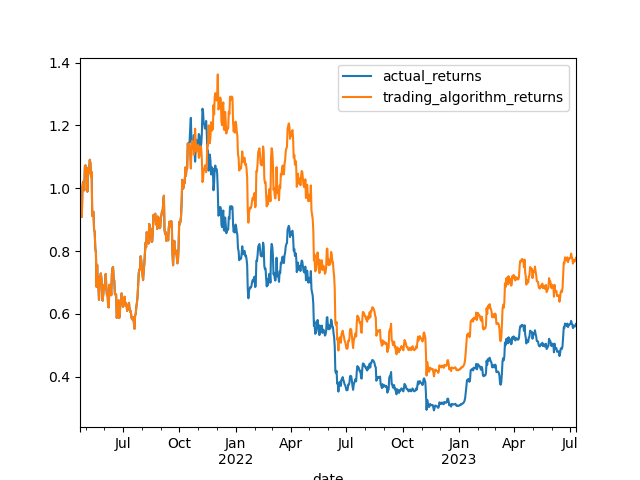

# The Coin Whisperer
## USYD FinTech Bootcamp July-2023 Group Project 2
*Group 3: Wasseem, Yanbo, Ferdows, Shayan*
### [Project website](https://fintechproject2.blob.core.windows.net/web-page/index.html)

**The code for this project is written in a Jupyter Lab Notebook using a Python Script** 

---
# Project Overview
**Aim: Create the ultimate crypto trading machine**

Considerations:
* Take desired crypto ticker
* Consider available historical data
* Perform machine learning (ML) analysis on the data
  * See next slide for details
* Outputs of ML analysis to be compared and validated
* Add sentiment analysis to the mix and use the combination to:
* Recommend trading strategy (buy/sell and price)
* Output to be displayed and executable on a webpage

# Usage and Installation Guide

# Installs needed for the code
- [yfinance](https://pypi.org/project/yfinance/)
- [arch](https://pypi.org/project/arch/)
- [fear_and_greed](https://pypi.org/project/fear-and-greed/)
- [selenium](https://pypi.org/project/selenium/)

Additionally, please ensure the following libraries and dependencies are installed and available for code execution

*For additional context see "Libraries and Dependencies" section of the code:*

### Base Libraries
- pandas, numpy,time, os, Path from pathlib, hvplot.pandas, yfinance, load_dotenv from dotenv  

### Machine Learning
- plt, ticker, mpimg, pyplot, inline from [matplotlib](https://pypi.org/project/matplotlib/) 
- DateOffset from pandas.tseries.offsets  
- svm, StandardScaler, LinearRegression, LogisticRegression, train_test_split, StandardScaler, OneHotEncoder, classification_report, mean_squared_error, r2_score, confusion_matrix, accuracy_score, and classification_report from [sklearn](https://scikit-learn.org/stable/)
- Prophet from [prophet](https://facebook.github.io/prophet/)  
- Dense and Sequential from [tensorflow](https://www.tensorflow.org)
-  Dense, Activation, Dropout from [keras](https://keras.io)
- arch_model from [arch](https://arch.readthedocs.io/en/latest/)

#### Additional Work
- fear_and_greed
- alpaca_trade_api

# Model Reports and Outputs
## 1. Logistic Regression

Model Evalution Report

Training Output

                      precision    recall  f1-score   support

         0.0             0.00      0.00      0.00       575
         1.0             0.51      1.00      0.67       595
         accuracy                            0.51      1170
         macro avg       0.25      0.50      0.34      1170
         weighted avg    0.26      0.51      0.34      1170

After increasing the dataset:

                    pre       rec       spe        f1       geo       iba       sup

        0.0       0.00      0.00      1.00      0.00      0.00      0.00       185
        1.0       0.98      1.00      0.00      0.99      0.00      0.00      9187

After resampling the dataset:

                    pre       rec       spe        f1       geo       iba       sup

        0.0       0.49      1.00      0.00      0.65      0.00      0.00       190
        1.0       0.00      0.00      1.00      0.00      0.00      0.00       201

  
## 2. Linear Regression

Model Evalution Report

                                   value
         score                     0.810619
         r2                        0.810619
         mean squared error        0.000142     
         root mean squared error   0.011939
         standard deviation        0.027436

    Linear Regression Prediction Plot

## 3. GARCH

Zero Mean - GARCH Model Results

                Dep. Variable:	    actual_returns	              R-squared:	  0.000
                Mean Model:	        Zero Mean	            Adj. R-squared:	  0.001
                Vol Model:	        GARCH	                Log-Likelihood:	 2998.23
                Distribution:	    Normal	                           AIC:	-5990.46
                Method:	            Maximum Likelihood	               BIC:	-5974.40
                                                          No. Observations:	  1560
                Date:	            Wed, Jul 12 2023          Df Residuals:	  1560
                Time:	            20:56:01	                  Df Model:	    0

    Volatility Model
                coef	        std err	    t	        P>|t|	        95.0% Conf. Int.
    omega	   1.0337e-04	  2.936e-05	   3.521	  4.296e-04	      [4.583e-05,1.609e-04]
    alpha[1]   0.1018	      3.871e-02	   2.630	  8.532e-03	      [2.594e-02, 0.178]
    beta[1]	   0.8279	      3.593e-02	   23.041	  1.805e-117	  [ 0.757, 0.898]

    Garch Volatility Plot

    Garch Forecast Plot

## 4. SVM

Model Evalution Report

                          precision   recall  f1-score     support
          -1.0               0.54      0.09      0.16       347
           1.0               0.53      0.93      0.68       385
          accuracy                               0.53       732
          macro avg          0.54      0.51      0.42       732
          weighted avg       0.54      0.53      0.43       732

    SVM Prediction Plot

## 5. Neural Network

Model Evalution Report

                                   Value
         Loss                     0.55001
         Accuracy                 0.77949

## 6. Prophet

Model Prediction Outcome

                                    Price
         Best Case                33566.16443
         Worst Case               25505.97644
         Most Likely Case         29518.59629

    Prophet Prediction Plot

## Deep Dive: 
Develop a supervised machine learning model that uses Linear Regression to Forecast using Prophet predictions as training data.

Model Prediction Outcome

                                            Value
      Loss Absolute Error                 613.4749
      Loss Absolute Percentage Error      2.21252 %

    Supervised Linear Regression vs Prophet

# Links
* [GitHub Repo Link](https://github.com/YanboZhu1989/FinTech_Project_2.git)
* [Project Folder](https://drive.google.com/drive/folders/1nUekI4111UTUd9Az__QJC9vdLuj1YYQK?usp=sharing)
* [Meeting Notes and Project Doc](https://docs.google.com/document/d/1I_i6JGlAO6SgynetaENlZ5KDaHw66uHzHLZBa2tHPOw/edit?usp=sharing)
* [The Coin Whisperer Webpage](https://fintechproject2.blob.core.windows.net/web-page/index.html)

# Resources and References
- https://edition.cnn.com/markets/fear-and-greed?utm_source=business_ribbon
- https://pypi.org/project/fear-and-greed/
- https://stackoverflow.com/questions/9622163/save-plot-to-image-file-instead-of-displaying-it
- https://arch.readthedocs.io/en/latest/univariate/generated/arch.univariate.GARCH.html#arch.univariate.GARCH
- https://www.investopedia.com/terms/g/garch.asp#:~:text=GARCH%20is%20a%20statistical%20modeling,an%20autoregressive%20moving%20average%20process.
- https://www.capitalone.com/tech/machine-learning/what-is-logistic-regression/
- https://monkeylearn.com/blog/introduction-to-support-vector-machines-svm/
- https://www.investopedia.com/articles/trading/06/neuralnetworks.asp#:~:text=Neural%20networks%20do%20not%20make,using%20traditional%20technical%20analysis%20methods
- https://facebook.github.io/prophet/#:~:text=Prophet%20is%20a%20procedure%20for,several%20seasons%20of%20historical%20data
- https://blog.devgenius.io/how-to-buy-and-sell-a-stock-with-python-439cf79ba8f1
- Presentation images/artwork  Google Images

